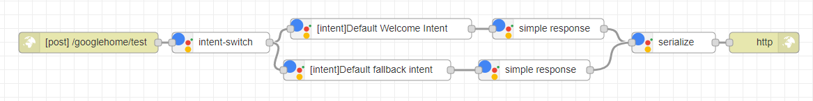

# node-red-contrib-actions-google
```
Note : This library is under rapid development, there will be new change everyday, make sure to come back to check new feature every now and then.
Feel free to raise issues and feature requests, and if you want to join as contributor, please contact me.
```
```
Note : For now this library only support Actions on Google with Dialogflow
```
Node Red's Actions on Google library that enable you to use node-red's Gui tool to build a Google assistant chatbot.
## Installation
Under your `~/.ndoe-red folder` run the following command:
```
npm install node-red-contrib-actions-google
```

## How to use

### What you'll need

* An Actions on Google project configured and connected to your Dialogflow agent.
* Configure your Dialogflow agent to use your node-red server as webhook fullfillment.

### Simple Example

Below is a super simple chatbot example with two intents (Deafult Welcome Intent and Default fallback Intent).



Note that:
* Use node-red's `http in` and `http response` node to create webhook for Dialogflow agent.
* Connect `intent switch` node with `intent` node to identify intent.
* You can use `simple response` node to respond plain text
* You have to connect to `actions serialize` node before http response

### Customize Response

You can also connect intent with `function` node, and access `conv` object through `msg.conv` , You can access Actions on Google's Rich Response Object through `global.get('actions-on-google')`, like the code snippet below:

```javascript
const {BasicCard, Image} = global.get('actions-on-google');
msg.conv.ask('Hello');
msg.conv.ask(new BasicCard({
    title:'Basic Card',
    text: 'This is basic card',
    image : new Image({
        url : 'url to your image',
        alt : 'image alt text'
    })
}))
return msg;
```

For more information on Rich Response, you can visit [here]( https://developers.google.com/assistant/conversational/responses ).